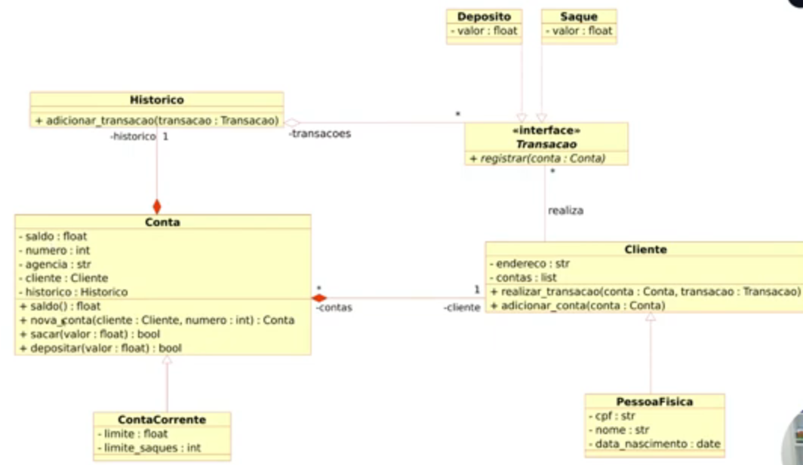

# Projeto Sistema Bancário

Aqui está listado os projetos desenvolvidos com base na criação de um Sistema Bancário

## Sistema Bancario Sequencial: 

 É o desenvolvimento de um pequeno algoritmo simples para um "Sistema Bancário" com a Linguagem Python com as essas funcionalidades em específico: Saque, Depósito e Visualizar extrato 

<ul>
  <li>Depósito: Utilização de valores positivos para passar no depósito da conta bancária</li>
  <li>Saque: Utilização de valores positivos para coletar determinada quantidade de reais depositado na conta (com 3 saques diários e com um limite de 500 R$ por saque)</li>
  <li>Extrato: Passar o histórico sequencial dos depósitos no formato "R$ xxx.xx" e no final da impressão o saldo atual da conta após as operaçõe</li>
</ul>

O algoritmo está armazenado em "SistemaBancarioSequencial.py"

## Sistema Bancário Funções

 É a primeira refatoração do algoritmo do "Sistema Bancário" com a utilização de módulos e a adição de mais funcionalidades como Criar conta e Usuário: 

<ul>
  <li>Utiliza diversas formas das funções receberem argumento (como a keyword e positional only)</li>
  <li>Algumas das funções retornam mais que 2 valores</li>
  <li>Comparado com o anterior, dá para ver que a repartição da funcionalidades de cada "case" em funções deixa o código bem mais fácil de compreender</li>
  <li>Para criar uma conta, primeiro deve se criar o usuário e seus dados como o CPF para depois, por esse mesmo valor, criar uma conta (ao fazer isso é possível ver todas as contas que foram criadas por uma listagem)</li>
  <li>Um usuário pode ter mais de uma conta, mas uma conta pode ser utilizada só por um usuário</li>
  <li>Extra: para a criação de usuários foi desenvolvido um pequeno código para utilizar como Regex do CPF (assim, é obrigatório que o usuário coloque o número de CPF no formato de 11 números)</li> 
</ul>

O algoritmo está armazenado em "SistemaBancarioFuncoes.py"

## Sistema Bancario POO

É a versão final (no caso dos desenvolvidos obrigatoriamente no Bootcamp) do algoritmo do "Sistema Bancário" com uma abordagem mais complexo e uso do paradigma da Programação Orientada a Objetos 

<ul>
  <li>As classes são todas baseadas em um diagrama de classe que está no diretório no anexo do repositório</li>
  <li>Além de contar com classes mais genéricas, como a "Conta", "Cliente" e "Transação", conta com outras mais específicas ou completas como "ContaCorrente", "PessoaFísica", etc.</li>
  <li>A principal mudança da versão anterior (referente as das funções) para essa é a abordagem de classes - que deixaram os módulos e o "main" do código ainda mais limpos e com poucas variáveis e o controle das contas</li>
  <li>Como um usuário pode ter mais de uma conta, ações como "Sacar", "Depositar", "Emitir Extrato" e "Listar Contas" necessitam da entrada da chave única do usuário (CPF) para confirmar o acesso agora. Além disso, existe a possibilidade do cliente escolher a conta que deseja utilizar nas 3 primeiras utilidades citadas anteriormente</li>
</ul>

 O algoritmo está armazenado em "SistemaBancarioPOO.py" e a imagem do Diagrama de Classes utilizado como base é o abaixo: 

## SistemaBancario Final

É um complemento de todos os outros que decidi criar com base em conhecimentos adiquirido próximo do final do Bootcamp, como a utilização de Decoradores, Iteradores e Geradores, a classe datetime e a manipulação de arquivos: 

<ul>
  <li>Decorador como um log da ações do sistema</li>
  <li>Iterador como a padronização das listagens de conta</li>
  <li>Gerador para a geração de relatórios</li>
  <li>Datetime para marcar o horário de ação no sistema</li>
  <li>Criação de arquivo para passar os logs do sistema em um "txt"</li>
</ul>

O algoritmo está armazenado em "SistemaBancarioFinal.py"

